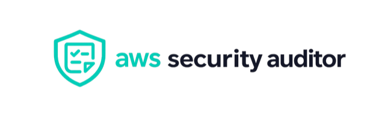

# aws-security-auditor

<p align="center">
  
</p>

<p align="center">
  <a href="https://github.com/mstrugarevic1/aws-security-auditor/actions/workflows/test.yml"></a>
  
  
  
  
</p>

`aws-security-auditor` is a small Python CLI that scans an AWS account for common security,
cost, and governance posture issues.

This tool never modifies AWS resources. It performs only read-only List, Get and Describe
operations and can be used with a read-only IAM role.

This tool is not a replacement for AWS Security Hub, AWS Config, CloudTrail, Trusted Advisor,
Prowler, or a formal security assessment. It is a point-in-time read-only scanner for quick
account reviews.

## Install

Requires Python 3.11+.

```bash
git clone https://github.com/mstrugarevic1/aws-security-auditor.git
cd aws-security-auditor
python -m venv .venv
source .venv/bin/activate
python -m pip install -e .
```

For local development:

```bash
python -m pip install -e ".[dev]"
```

## Usage

Common examples:

```bash
aws-security-auditor scan --profile audit
aws-security-auditor scan --profile audit --regions eu-central-1,eu-west-1
aws-security-auditor scan --profile audit --services ec2,s3,iam
aws-security-auditor scan --profile audit --config examples/aws-security-auditor.toml
aws-security-auditor scan --profile audit --fail-on HIGH --notify-on HIGH
```

Options:

| Option | Purpose |
| --- | --- |
| `--profile PROFILE` | Use a named AWS profile. |
| `--config PATH` | Load TOML config for required tags and critical-resource tag values. |
| `--role-arn ROLE_ARN` | Assume a read-only audit role before scanning. |
| `--external-id EXTERNAL_ID` | Pass an external ID when assuming a role. |
| `--regions REGION1,REGION2` | Scan only the listed AWS regions. |
| `--exclude-regions REGION1,REGION2` | Skip the listed AWS regions. |
| `--services ec2,s3,iam` | Scan only selected services. |
| `--output table,json,markdown,csv` | Choose the report format. |
| `--output-file PATH` | Write the report to a file. |
| `--severity HIGH,MEDIUM,LOW` | Show findings at this severity or higher. |
| `--fail-on HIGH,MEDIUM,LOW` | Exit with status `1` when this severity or higher is found. |
| `--no-color` | Disable terminal color. |
| `--verbose` | Show skipped regions and warnings. |
| `--snapshot-age-days 90` | Set the old snapshot threshold. |
| `--access-key-age-days 90` | Set the old access key threshold. |
| `--required-tags Owner,Environment,CostCenter` | Set required resource tags. |
| `--max-workers 5` | Set the maximum regional scan worker threads. |
| `--notify-on HIGH,MEDIUM,LOW` | Send a Slack notification when this severity or higher is found. |
| `--slack-webhook-url URL` | Send Slack notifications to this incoming webhook URL. |

By default the scanner discovers all enabled AWS regions with `ec2:DescribeRegions`. It scans
`opt-in-not-required` and `opted-in` regions, and skips `not-opted-in` regions. IAM, STS, and
S3 bucket enumeration run once as global/account-level checks.

Use `--services` to scan only selected services.

| Service | Default | Scope |
| --- | --- | --- |
| `ec2` | Yes | EC2 instances, security groups, EBS volumes, snapshots, AMIs, and Elastic IPs. |
| `ecr` | Yes | ECR repository scan-on-push settings. |
| `elbv2` | Yes | Application and Network Load Balancers. |
| `iam` | Yes | Account-level IAM posture. |
| `kms` | Yes | Customer-managed KMS key rotation. |
| `rds` | Yes | RDS public access, encryption, and backup posture. |
| `s3` | Yes | S3 bucket public access, encryption, versioning, and logging. |
| `tags` | Yes | Required tags on supported resources. |
| `cloudtrail` | No | Account baseline check for CloudTrail trails. |
| `config` | No | Account baseline check for AWS Config recorders. |
| `guardduty` | No | Account baseline check for GuardDuty detectors. |
| `securityhub` | No | Account baseline check for Security Hub enablement. |

Use `--severity MEDIUM` to show `HIGH` and `MEDIUM` findings. Use `--severity HIGH` to show only
high-severity findings.

Use `--fail-on HIGH` in CI or scheduled jobs when high-severity findings should fail the run.

Recommended scheduled scan:

```bash
aws-security-auditor scan \
  --profile audit \
  --config examples/aws-security-auditor.toml \
  --fail-on HIGH \
  --notify-on HIGH
```

## Slack notifications

Use `--notify-on` with a Slack incoming webhook when scheduled scans should notify a channel.
The webhook can be passed directly or read from `AWS_SECURITY_AUDITOR_SLACK_WEBHOOK_URL`:

```bash
export AWS_SECURITY_AUDITOR_SLACK_WEBHOOK_URL="$SLACK_WEBHOOK_URL"
aws-security-auditor scan --profile audit --notify-on HIGH
```

`--notify-on HIGH` sends only when `HIGH` findings exist. `MEDIUM` includes `HIGH` and
`MEDIUM`; `LOW` sends for any finding. Slack delivery failure prints a warning but does not
change the scan exit code. `--fail-on` still controls CI failure behavior independently.

The webhook URL is never printed by the tool and must use HTTPS.

## Config file

Use a TOML config file when tag names or critical-resource markers differ by environment:

```bash
aws-security-auditor scan --profile audit --config aws-security-auditor.toml
```

Example:

```toml
required_tags = ["Owner", "Environment", "CostCenter"]

[critical_resource_tags]
Environment = ["prod", "production", "prd"]
Criticality = ["high", "critical", "tier1"]
```

See [examples/aws-security-auditor.toml](examples/aws-security-auditor.toml) for a reusable
starting point.

| Setting | Purpose |
| --- | --- |
| `required_tags` | Tags required by the tag governance check. |
| `critical_resource_tags` | Tag values that raise severity for resilience-sensitive findings such as disabled RDS backups or deletion protection. |

Tags tune severity and context only. Missing tags do not suppress direct security exposure checks.

## Hygiene vs baseline checks

The default scan focuses on resource hygiene: public exposure, weak IAM posture, missing
encryption, missing backups, unused network resources, and required tag coverage.

Account baseline services are available when explicitly selected:

```bash
aws-security-auditor scan --services cloudtrail,config,guardduty,securityhub
```

CloudTrail, AWS Config, GuardDuty, and Security Hub are important account setup controls. Their
absence is treated as a baseline/setup gap rather than a default resource hygiene finding.

Public access, IAM risk, public snapshots, and similar direct risks are evaluated from AWS
resource configuration whether tags exist or not.

## Authentication

Supported authentication:

- default boto3 credential chain
- named AWS profile with `--profile`
- STS AssumeRole with `--role-arn` and optional `--external-id`

Recommended approach: use a dedicated read-only role.

```bash
aws-security-auditor scan \
  --role-arn arn:aws:iam::123456789012:role/AwsSecurityAuditorReadOnly
```

Example trust policy:

```json
{
  "Version": "2012-10-17",
  "Statement": [
    {
      "Effect": "Allow",
      "Principal": {"AWS": "arn:aws:iam::111122223333:root"},
      "Action": "sts:AssumeRole"
    }
  ]
}
```

The tool does not require administrator permissions. Some checks may be skipped when the role
lacks access to specific services.

Before scanning it calls `sts:GetCallerIdentity` and displays the account ID, ARN, selected
profile or assumed role, and region count. It never prints credentials, tokens, or secrets.

## Checks

Severity meanings:

| Severity | Meaning |
| --- | --- |
| `HIGH` | Likely security exposure requiring prompt review. |
| `MEDIUM` | Cost, resilience, or exposure issue worth fixing. |
| `LOW` | Governance or security posture improvement. |

Implemented checks:

| Area | Checks |
| --- | --- |
| EC2 security groups | Public ingress for SSH, RDP, HTTP, HTTPS, database ports, all ports, and other ports; default security groups with public ingress; unused security groups. |
| EC2 capacity and images | Unused Elastic IPs, unattached or unencrypted EBS volumes, disabled EBS encryption by default, old account-owned EBS snapshots, public account-owned AMIs, public EBS snapshots. |
| EC2 instances | Public instances whose security groups expose internet ingress. |
| RDS | Public, unencrypted, under-backed-up, or deletion-protection-disabled database instances. |
| S3 | Public ACL/policy, Public Access Block, encryption, versioning, and access logging. |
| IAM | Root MFA, root access keys, password policy, old or unused access keys, console users without MFA, direct inline user policies, AdministratorAccess exposure. |
| Load balancing | Internet-facing Application and Network Load Balancers. |
| ECR | Scan-on-push settings. |
| KMS | Key rotation for eligible customer-managed keys. |
| Tags | Missing required tags on EC2 instances, EBS volumes, and RDS instances. |
| Baseline services | CloudTrail trails, AWS Config recorders, GuardDuty detectors, and Security Hub enablement when explicitly selected. |

## How this differs from AWS native services

CloudTrail records AWS API activity. AWS Config records resource configuration history. Security
Hub aggregates posture findings across accounts and services.

`aws-security-auditor` is different: it gives a fast read-only snapshot without requiring those
managed services to be enabled first.

## Example Output

```text
+----------+--------------------------+---------+-----------+-------------------------------+
| Severity | Region                   | Service | Resource  | Finding                       |
+----------+--------------------------+---------+-----------+-------------------------------+
| HIGH     | global                   | IAM     | root      | Root account MFA is disabled  |
| HIGH     | eu-central-1 (Frankfurt) | EC2     | sg-012345 | SSH open to the world         |
| MEDIUM   | eu-west-1 (Ireland)      | RDS     | prod-db   | Deletion protection disabled  |
| LOW      | us-east-1 (N. Virginia)  | ECR     | app       | ECR scan on push is disabled  |
+----------+--------------------------+---------+-----------+-------------------------------+

Scanned regions: 18
Checks executed: 31
Resources inspected: 421
HIGH: 4
MEDIUM: 6
LOW: 3
Errors: 1
Duration: 12.4s
```

With `--fail-on HIGH`, the report is still rendered, but the command exits with status `1`
when at least one `HIGH` finding is present.

JSON and Markdown reports contain no ANSI color codes.
CSV reports contain one row per finding.

## Safety

All AWS calls pass through a local read-only client wrapper with an explicit operation allowlist.
If code tries to call an unapproved operation such as `delete_volume` or `stop_instances`, the
wrapper raises before boto3 is called. There is no remediation mode and no `--fix`, `--delete`,
or cleanup flag.

## Limitations

- It checks common security posture issues only.
- It does not inspect S3 objects or object contents.
- It does not remediate findings.
- IAM direct managed policy attachment checks are intentionally omitted because the AWS API name
  contains `Attach`, which this project blocks by policy.
- API errors are reported and the scan continues where possible.

## Development

```bash
ruff check .
mypy src
pytest
```

CI runs those commands without AWS credentials and without integration tests against a real account.

## License

MIT. See [LICENSE](LICENSE).
