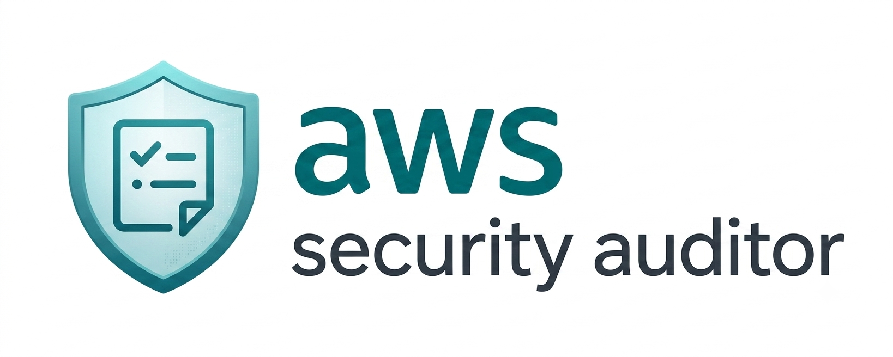
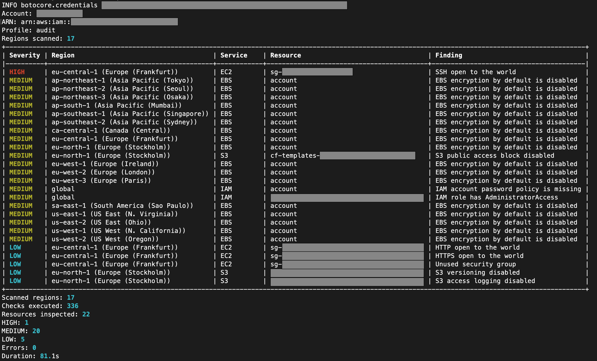

# aws-security-auditor

<p align="center">
  
</p>

<p align="center">
  <a href="https://github.com/mstrugarevic1/aws-security-auditor/actions/workflows/test.yml"></a>
  
  
  
  
</p>

`aws-security-auditor` is a small Python CLI that scans an AWS account for common security,
cost, and governance posture issues.

This tool never modifies AWS resources. It performs only read-only List, Get and Describe
operations and can be used with a read-only IAM role.

<p align="center">
  
</p>

This tool is not a replacement for AWS Security Hub, AWS Config, CloudTrail, Trusted Advisor,
Prowler, or a formal security assessment. It is a point-in-time read-only scanner for quick
account reviews.

## Install

Requires Python 3.11+.

Releases are published on the
[Releases page](https://github.com/mstrugarevic1/aws-security-auditor/releases) as a wheel.
This project is not published on PyPI, so install from a release URL.

With `pipx`, which keeps the tool in its own virtualenv:

```bash
pipx install https://github.com/mstrugarevic1/aws-security-auditor/releases/download/v0.1.0/aws_security_auditor-0.1.0-py3-none-any.whl
```

With `pip`, into an existing virtualenv:

```bash
python -m pip install https://github.com/mstrugarevic1/aws-security-auditor/releases/download/v0.1.0/aws_security_auditor-0.1.0-py3-none-any.whl
```

Both install the `aws-security-auditor` command and pull `boto3`, `rich`, and `typer` from
PyPI. Check the install:

```bash
aws-security-auditor --help
```

To upgrade, install the wheel URL of a newer tag. With `pipx` use `pipx install --force`.

To install from source instead:

```bash
git clone https://github.com/mstrugarevic1/aws-security-auditor.git
cd aws-security-auditor
python -m venv .venv
source .venv/bin/activate
python -m pip install -e .
```

## Quick start

```bash
aws-security-auditor scan --profile audit
aws-security-auditor scan --profile audit --regions eu-central-1,eu-west-1
aws-security-auditor scan --profile audit --services ec2,s3,iam
aws-security-auditor scan --profile audit --fail-on HIGH
```

The scan discovers all enabled AWS regions by default and reports findings at `HIGH`, `MEDIUM`,
and `LOW` severity. Use `--fail-on HIGH` in CI to exit non-zero on high-severity findings.

Run `aws-security-auditor scan --help` for the full option list.

## Documentation

| Page | Contents |
| --- | --- |
| [docs/usage.md](docs/usage.md) | Options, services, regions, severity filtering, Slack notifications. |
| [docs/checks.md](docs/checks.md) | Every implemented check, severity meanings, hygiene vs baseline scans. |
| [docs/configuration.md](docs/configuration.md) | TOML config, required tags, suppressions. |
| [docs/authentication.md](docs/authentication.md) | Credential chain, profiles, AssumeRole, trust policy. |
| [CHANGELOG.md](CHANGELOG.md) | Release history. |

## How this differs from AWS native services

CloudTrail records AWS API activity. AWS Config records resource configuration history. Security
Hub aggregates posture findings across accounts and services.

`aws-security-auditor` is different: it gives a fast read-only snapshot without requiring those
managed services to be enabled first.

## Safety

All AWS calls pass through a local read-only client wrapper with an explicit operation allowlist.
If code tries to call an unapproved operation such as `delete_volume` or `stop_instances`, the
wrapper raises before boto3 is called. There is no remediation mode and no `--fix`, `--delete`,
or cleanup flag.

## Limitations

- It checks common security posture issues only.
- It does not inspect S3 objects or object contents.
- It does not read Secrets Manager secret values.
- It does not remediate findings.
- ECS checks cover services and their current task definitions, not standalone tasks.
- IAM direct managed policy attachment checks are intentionally omitted because the AWS API name
  contains `Attach`, which this project blocks by policy.
- API errors are reported and the scan continues where possible.

## Development

```bash
python -m pip install -e ".[dev]"
ruff check .
mypy src
pytest
```

CI runs those commands without AWS credentials and without integration tests against a real account.

## Releasing

Releases are tagged from `main`. The `release` workflow verifies the tag matches the version in
`pyproject.toml`, builds the sdist and wheel, and creates the GitHub Release with notes generated
from the commits since the previous tag. The `test` workflow already ran the checks on `main`.

1. Bump `version` in `pyproject.toml`.
2. Move the `[Unreleased]` entries in `CHANGELOG.md` under a `## [0.2.0] - YYYY-MM-DD` heading,
   and update the link definitions at the bottom of the file.
3. Commit, then tag and push:

```bash
git tag v0.2.0
git push origin v0.2.0
```

A tag that does not match `pyproject.toml` fails the release workflow before anything is published.
`CHANGELOG.md` is maintained by hand and is not read by the workflow.

## License

MIT. See [LICENSE](LICENSE).
